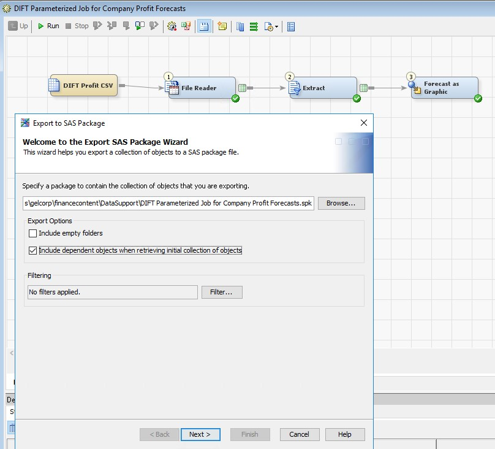
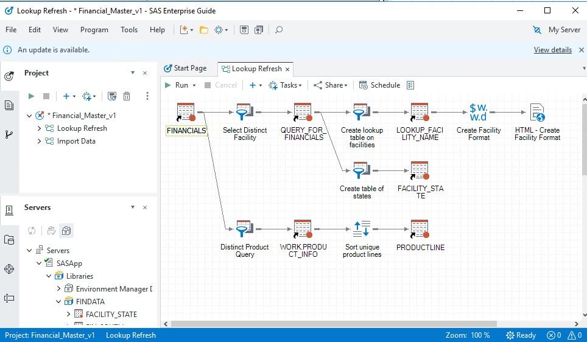

# Automating the move to Viya with CICD

2023 looks to be our year of moving to SAS Viya from SAS 94 for many of our customers. Those of us who have tried doing this, i.e. through the [PSGEL270 training](https://eduvle.sas.com/course/view.php?id=1985&section=5#tabs-tree-start) or even done it with customers have most likely experienced that this work is tedious and requires tight attention to details.

And as humans we are not always good at that – we get bored and sloppy, and mistakes may happen.

So why not automate this and have a computer do this for us? With CICD and devops being a thing – and our customers doing cicd all over the place, and us doing it ourselves with our own Viya, doing migration through CICD seems to be a sensible way of attacking this. Also – many of the tools for migration are well suited for automation – most of them have command-line options.

And as a CICD addict and true believer in all things agile, going cicd on migration makes a ton of sense.

This post will go through:

* Understanding and setting up the environments to prepare for CICD
* How to use git to transfer content between SAS94 and SAS Viya
* Using gitlab cicd to automate importing and validation of sas content to SAS Viya

The approach should in theory work well in github, Azure Devops and similar git management platforms – as the concepts for managing the CICD pipelines are quite similar. The approach is based on the [PSGEL270 training](https://eduvle.sas.com/course/view.php?id=1985&section=5#tabs-tree-start) and the [PSGEL283 training on devops principles to SAS Viya Data Management](https://eduvle.sas.com/course/view.php?id=1982). Those are highly recommended if you want to dig deeper into migration as well as devops with SAS.

## Understanding and setting up the environments to prepare for CICD
||
|-|

If you want to follow this process to the teeth, just book the [PSGEL270 environment](http://race.exnet.sas.com/Reservations?action=new&imageId=345656&imageKind=C&comment=%20PSGEL270%20VLE%20_CHAP4-ONLY_%20&purpose=PST&sso=PSGEL270&schedtype=SchedTrainEDU&startDate=now&endDateLength=3&discardonterminate=y) (just click the link to book it) - it will give you a SAS 94M7 environment as well as a SAS Viya environment (2022.11). The pipelines as such are tuned into how the SAS Viya environments on RACE are typically set up.

The SAS 94 environment comes with a fairly complete set of tools to manage and develop SAS artifacts:

* SAS Management console - provides a way to understand how libraries are set up, in our case we are using it to find out where the SAS datasets being used resides physically, and also changed the name to deal with a current bug in the migration process
* SAS DI studio - we want to import one SAS DI Studio job - and SAS DI Studio provides a convenient way of exporting SAS DI studio jobs and making it available in a git repo
* SAS Enterprise Guide - we want to import a flow from one Enterprise Guide project as well as take advantage of a fairly user friendly and SAS friendly user interface to git inside Enterprise Guide

This post focuses on content migration - data migration may very well be covered at a later stage - all kinds of interesting topics to cover; like conversion of encoding, migrating to different types of data sources, and latency when moving data. In this example, we simply copied the data sets as files from the SAS94 environment to the SAS Viya environment.

See the following picture for how to get the physical location of the SAS library we want to work with.
||
|-|

We are using git as a way of transferring test data and expected results to the SAS Viya environment - for the purpose of validation.

I did make a change from the PSGEL270 environment to avoid problems due to a bug with the current state of migration - changed the Libref to FINDATA instead of a name that is currently too long to survive how Enterprise Guide projects are migrated across. This may change at a later version - but as of now the name needs to change - either on the SAS94 side or the SAS Viya side.

SAS DI Studio has an export SAS Package function that can be used at any level - and in this case, we want to simply export one DI Job - as the following picture shows:
||
|-|

The path you see part of is part of a path to a folder that is managed by git - a repository that is cloned to the windows machine that has the SAS94 environment. I have made the git repository available on our internal [sas gitlab here](https://gitlab.sas.com/GEL/devopsnorth/migrate2viya).

This is intended to be shared, so feel free to fork it and use it as your own. As you may know, the SAS gitlab is not available from a RACE image - so you would need to get this into the public gitlab or another gitlab installation that RACE has access to, to be able to use the repo. There is no sensitive content in the repo - but just in case, I would advise to keep the repo private.

In Enterprise Guide we will work with the flow we want to get to SAS Viya - see below:
||
|-|

This Enterprise Guide project (Financial_Master_v1) is already saved to the repo, and if you want to follow this example, I would recommend that you simply load this. It is stored at C:\Users\student\work\migrate2viya\exported\EGProjects if you follow the instructions in this post. This project has the libref changed to a shorter name already - so it is prepared to get across to SAS Viya without any need to change to work. In practice you may want to do such changes on the SAS Viya side - and I have prepared the CICD pipeline in this case to have a manual step to do such changes before doing the final validation. The DI job above for instance will need such changes to work on the SAS Viya side.

