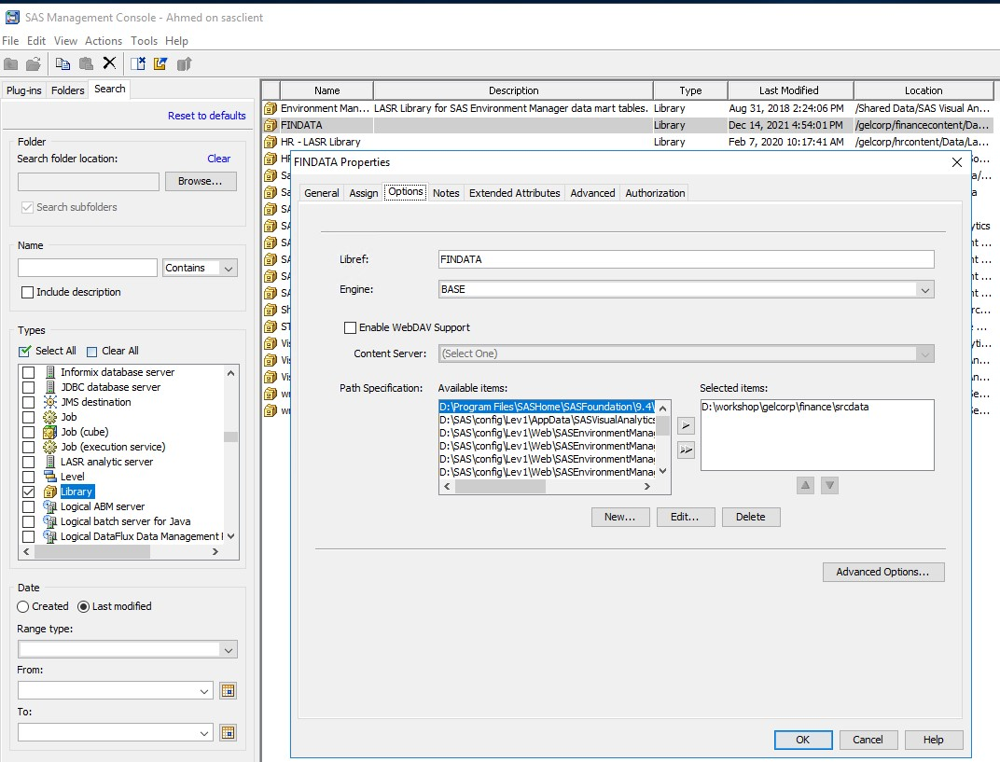

# Automating the move to Viya with CICD

2023 looks to be our year of moving to SAS Viya from SAS 94 for many of our customers. Those of us who have tried doing this, i.e. through the [PSGEL270 training](https://eduvle.sas.com/course/view.php?id=1985&section=5#tabs-tree-start) or even done it with customers have most likely experienced that this work is tedious and requires tight attention to details.

And as humans we are not always good at that – we get bored and sloppy, and mistakes may happen.

So why not automate this and have a computer do this for us? With CICD and devops being a thing – and our customers doing cicd all over the place, and us doing it ourselves with our own Viya, doing migration through CICD seems to be a sensible way of attacking this. Also – many of the tools for migration are well suited for automation – most of them have command-line options.

And as a CICD addict and true believer in all things agile, going cicd on migration makes a ton of sense.

This post will go through:

* Understanding and setting up the environments to prepare for CICD
* How to use git to transfer content between SAS94 and SAS Viya
* Using gitlab cicd to automate importing and validation of sas content to SAS Viya

The approach should in theory work well in github, Azure Devops and similar git management platforms – as the concepts for managing the CICD pipelines are quite similar. The approach is based on the [PSGEL270 training](https://eduvle.sas.com/course/view.php?id=1985&section=5#tabs-tree-start) and the [PSGEL283 training on devops principles to SAS Viya Data Management](https://eduvle.sas.com/course/view.php?id=1982). Those are highly recommended if you want to dig deeper into migration as well as devops with SAS.

## Understanding and setting up the environments to prepare for CICD
||
|-|
If you want to follow this process to the teeth, just book the [PSGEL270 environment](http://race.exnet.sas.com/Reservations?action=new&imageId=345656&imageKind=C&comment=%20PSGEL270%20VLE%20_CHAP4-ONLY_%20&purpose=PST&sso=PSGEL270&schedtype=SchedTrainEDU&startDate=now&endDateLength=3&discardonterminate=y) (just click the link to book it) - it will give you a SAS 94M7 environment as well as a SAS Viya environment (2022.11). The pipelines as such are tuned into how the SAS Viya environments on RACE are typically set up.

The SAS 94 environment comes with a fairly complete set of tools to manage and develop SAS artifacts:

* SAS Management console - provides a way to understand how libraries are set up, in our case we are using it to find out where the SAS datasets being used resides physically, and also changed the name to deal with a current bug in the migration process
* SAS DI studio - we want to import one SAS DI Studio job - and SAS DI Studio provides a convenient way of exporting SAS DI studio jobs and making it available in a git repo
* SAS Enterprise Guide - we want to import a flow from one Enterprise Guide project as well as take advantage of a fairly user friendly and SAS friendly user interface to git inside Enterprise Guide

This post focuses on content migration - data migration may very well be covered at a later stage - all kinds of interesting topics to cover; like conversion of encoding, migrating to different types of data sources, and latency when moving data. In this example, we simply copied the data sets as files from the SAS94 environment to the SAS Viya environment.

See the following picture for how to get the physical location of the SAS library we want to work with.
||
|-|

## Getting started

To make it easy for you to get started with GitLab, here's a list of recommended next steps.

Already a pro? Just edit this README.md and make it your own. Want to make it easy? [Use the template at the bottom](#editing-this-readme)!

## Add your files

- [ ] [Create](https://docs.gitlab.com/ee/user/project/repository/web_editor.html#create-a-file) or [upload](https://docs.gitlab.com/ee/user/project/repository/web_editor.html#upload-a-file) files
- [ ] [Add files using the command line](https://docs.gitlab.com/ee/gitlab-basics/add-file.html#add-a-file-using-the-command-line) or push an existing Git repository with the following command:

```
cd existing_repo
git remote add origin https://gitlab.com/nordics_de/import2viya.git
git branch -M main
git push -uf origin main
```

## Integrate with your tools

- [ ] [Set up project integrations](https://gitlab.com/nordics_de/import2viya/-/settings/integrations)

## Collaborate with your team

- [ ] [Invite team members and collaborators](https://docs.gitlab.com/ee/user/project/members/)
- [ ] [Create a new merge request](https://docs.gitlab.com/ee/user/project/merge_requests/creating_merge_requests.html)
- [ ] [Automatically close issues from merge requests](https://docs.gitlab.com/ee/user/project/issues/managing_issues.html#closing-issues-automatically)
- [ ] [Enable merge request approvals](https://docs.gitlab.com/ee/user/project/merge_requests/approvals/)
- [ ] [Automatically merge when pipeline succeeds](https://docs.gitlab.com/ee/user/project/merge_requests/merge_when_pipeline_succeeds.html)

## Test and Deploy

Use the built-in continuous integration in GitLab.

- [ ] [Get started with GitLab CI/CD](https://docs.gitlab.com/ee/ci/quick_start/index.html)
- [ ] [Analyze your code for known vulnerabilities with Static Application Security Testing(SAST)](https://docs.gitlab.com/ee/user/application_security/sast/)
- [ ] [Deploy to Kubernetes, Amazon EC2, or Amazon ECS using Auto Deploy](https://docs.gitlab.com/ee/topics/autodevops/requirements.html)
- [ ] [Use pull-based deployments for improved Kubernetes management](https://docs.gitlab.com/ee/user/clusters/agent/)
- [ ] [Set up protected environments](https://docs.gitlab.com/ee/ci/environments/protected_environments.html)

***

# Editing this README

When you're ready to make this README your own, just edit this file and use the handy template below (or feel free to structure it however you want - this is just a starting point!). Thank you to [makeareadme.com](https://www.makeareadme.com/) for this template.

## Suggestions for a good README
Every project is different, so consider which of these sections apply to yours. The sections used in the template are suggestions for most open source projects. Also keep in mind that while a README can be too long and detailed, too long is better than too short. If you think your README is too long, consider utilizing another form of documentation rather than cutting out information.

## Name
Choose a self-explaining name for your project.

## Description
Let people know what your project can do specifically. Provide context and add a link to any reference visitors might be unfamiliar with. A list of Features or a Background subsection can also be added here. If there are alternatives to your project, this is a good place to list differentiating factors.

## Badges
On some READMEs, you may see small images that convey metadata, such as whether or not all the tests are passing for the project. You can use Shields to add some to your README. Many services also have instructions for adding a badge.

## Visuals
Depending on what you are making, it can be a good idea to include screenshots or even a video (you'll frequently see GIFs rather than actual videos). Tools like ttygif can help, but check out Asciinema for a more sophisticated method.

## Installation
Within a particular ecosystem, there may be a common way of installing things, such as using Yarn, NuGet, or Homebrew. However, consider the possibility that whoever is reading your README is a novice and would like more guidance. Listing specific steps helps remove ambiguity and gets people to using your project as quickly as possible. If it only runs in a specific context like a particular programming language version or operating system or has dependencies that have to be installed manually, also add a Requirements subsection.

## Usage
Use examples liberally, and show the expected output if you can. It's helpful to have inline the smallest example of usage that you can demonstrate, while providing links to more sophisticated examples if they are too long to reasonably include in the README.

## Support
Tell people where they can go to for help. It can be any combination of an issue tracker, a chat room, an email address, etc.

## Roadmap
If you have ideas for releases in the future, it is a good idea to list them in the README.

## Contributing
State if you are open to contributions and what your requirements are for accepting them.

For people who want to make changes to your project, it's helpful to have some documentation on how to get started. Perhaps there is a script that they should run or some environment variables that they need to set. Make these steps explicit. These instructions could also be useful to your future self.

You can also document commands to lint the code or run tests. These steps help to ensure high code quality and reduce the likelihood that the changes inadvertently break something. Having instructions for running tests is especially helpful if it requires external setup, such as starting a Selenium server for testing in a browser.

## Authors and acknowledgment
Show your appreciation to those who have contributed to the project.

## License
For open source projects, say how it is licensed.

## Project status
If you have run out of energy or time for your project, put a note at the top of the README saying that development has slowed down or stopped completely. Someone may choose to fork your project or volunteer to step in as a maintainer or owner, allowing your project to keep going. You can also make an explicit request for maintainers.
